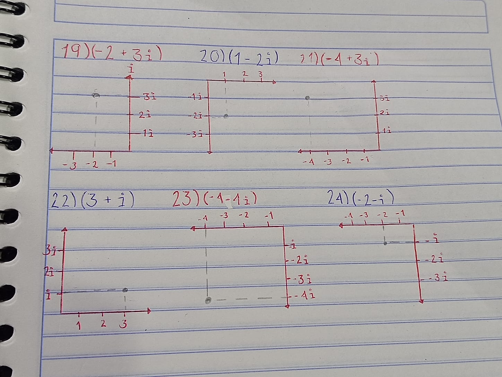

# Fundamentos de Álgebra

## Actividad #5 - Números complejos.

## Alumna: Mariana Donaji López Heredia
---
#### Ubica los siguientes puntos en el plano cartesiano.

---
#### Resuelve las siguientes operaciones con los números complejos.

25.(-7 - 4i) - (2 + i)

  
   |  R   |    i  |
  |-------|-------| 
  | (-7)  | (-4i) |
  |- (2)  | - (i) | 
  |-------|-------|
  |   -9  |    -5i|

El resultado de $(-7 - 4i) - (2 + i) = (-9 - 5i)$

26.(2 - 4i) - (5 - 3i)

 
  |   R   |   i   |
  |-------|-------| 
  |  (2)  | (-4i) |
  |- (5)  |- (-3i)| 
  |-------|-------|
  |   -3  |  -i   |

El resultado de $(2 - 4i) - (5 - 3i) = (-3 -i)$

27.(7 - 8i) - (3i) - 7

  |   R   |   i   | 
  |-------|-------| 
  |  (1)  |  (5i) |
  | (-8)  | (-5i) | 
  |  (3)  |       |
  |-------|-------|  
  |  -4   |  0    |

El resultado de $(7 - 8i) - (3i) - 7 = (-11i)$

28.(1 + 5i) + (-8 - 5i) + 3

  |   R   |   i   | 
  |-------|-------| 
  |  (1)  |  (5i) |
  | (-8)  | (-5i) | 
  |  (3)  |       |  
  |-------|-------|
  |  -4   |  0    |

El resultado de $(1 + 5i) + (-8 - 5i) + 3 = (-4)$

29.-8 - (3 - 5i) + (4 + 8i)

  |   R   |    i  |
  |-------|-------| 
  |  (-8) |-(-5i) |
  | - (3) |  (8i) |  
  |  (4)  |       |
  |-------|-------|  
  |  -7   |  13i  |

El resultado de $-8 - (3 - 5i) + (4 + 8i) = (-7 + 13i)$

30.(-4 + 2i) + (3i) + (-4 - 7i)

  |   R   |    i  |
  |-------|-------| 
  |  (-4) |  (2i) |
  |  (-4) |  (3i) |  
  |       | (-7i) |
  |-------|-------|  
  |  -8   |  -2i  |

31.(2i) (-4i)

  |   R   |      |    i     |
  |-------|------|----------|
  |   0   |   0  |    2i    | 
  |   0   |   0  |${-8i^2}$ | 
  |   0   |   0  |    -4i   |
  
  1. ${-8i^2}$ se convierte en 8 al multiplicarlo por -1.

El resultado de $(2i) (-4i) = 8$

32.(-2i) (5i) $\times{6}$ 

  |   R   |      |    i      |
  |-------|------|-----------|
  |   0   |   0  |   -2i     | 
  |   0   |   0  |${-10i^2}$ | 
  |   0   |   0  |    5i     |
  
  1. ${-10i^2}$ se convierte en 10 al multiplicarlo por -1.
  2. $\textcolor{red}{10\times{6}}$ se multiplican para obtener el resultado final.

El resultado de $(-2i) (5i) = 10$

33.(-7i)(8 + 8i)(-2 - 8i)

  |   R   |      |     i     |
  |-------|------|-----------|
  |   0   |   0  |     -7i   | 
  |   0   |-56i  |${-56i^2}$ | 
  |   8   |-56i  |     8i    |

1. ${-56i^2}$ se convierte en 56 al multiplicarlo por -1. 
2. Ahora obtenemos un nuevo resultado $\textcolor{red}{(-56 + 56i)}$ por lo que se 
  multiplica con $\textcolor{red}{(-2 + 8i)}$.

  |   R   |      |     i     |
  |-------|------|-----------|
  |  56   | -448 |  -56i     | 
  | -112  |-336i |${448i^2}$ | 
  |  -2   | 112i |     8i    |

4. ${448i^2}$ se convierte en -448 al ser multiplicado por -1.
5. Por último se juntan terminos semejantes y se suman $\textcolor{red}{-112 -448} lo que nos da como resultado -560.

El resultado de $(-7i)(8 + 8i)(-2 - 8i)$

34.(-2 - 4i) (-1 - 6i) (7 - 6i)

  |   R   |      |     i     |
  |-------|------|-----------|
  |  -2   |  12i |     -4i   | 
  |   2   |  16i | ${24i^2}$ | 
  |  -1   |  4i  |    -6i    |

1. ${24i^2}$ se convierte en -24 al multiplicarlo por -1. 
2. $\textcolor{red}{-24 + 2}$ se suman al ser términos semejantes.
3. Ahora obtenemos un nuevo resultado $\textcolor{red}{(-22 + 16i)}$ por lo que se multiplica con $\textcolor{red}{(7 - 6i)}$.

  |   R   |      |     i     |
  |-------|------|-----------|
  |  -22  |  132 |   16i     | 
  |  -154 | 244i | ${-96^2}$ | 
  |   7   | 112i |    -6i    |

5. ${-96^2}$ se convierte en 96 al ser multiplicado por -1.
6. Por último se juntan terminos semejantes y se suman $\textcolor{red}{96 -154} lo que nos da como resultado -58.

El resultado de $(-2 - 4i) (-1 - 6i) (7 - 6i) =(58 + 224i) $

35.(3i) (1 - 7i) (7 + 4i)

  |   R   |      |     i     |
  |-------|------|-----------|
  |   0   |   0  |    3i     | 
  |   0   |  3i  |${-21i^2}$ | 
  |   1   |  3i  |    -7i    |

1. ${-21i^2}$ se convierte en 21 al multiplicarlo por -1. 
2. Ahora obtenemos un nuevo resultado $\textcolor{red}{(21 + 3i)}$ por lo que se multiplica con $\textcolor{red}{(7 + 4i)}$.

  |   R   |      |     i     |
  |-------|------|-----------|
  |  21   |  84i |    3i     | 
  |  147  | 105i | ${12i^2}$ | 
  |   7   |  21i |     4i    |

3. ${12i^2}$ se convierte en -12 al ser multiplicado por -1.
4. Por último se juntan terminos semejantes y se suman $\textcolor{red}{147 - 12} lo que nos da como resultado 135.

El resultado de $(3i) (1 - 7i) (7 + 4i) = (135 + 105i)$

36.(-6i) (-5 + i) (6 - 2i)

  |   R   |      |     i     |
  |-------|------|-----------|
  |   0   |   0  |   -6i     | 
  |   0   | 30i  | ${-6i^2}$ | 
  |   -5  | 30i  |    i      |

1. ${-6i^2}$ se convierte en 6 al multiplicarlo por -1. 
2. Ahora obtenemos un nuevo resultado $\textcolor{red}{(6 + 30i)}$ por lo que se multiplica con $\textcolor{red}{(6 - 2i)}$.

  |   R   |      |     i     |
  |-------|------|-----------|
  |   6   | -12i |    30i    | 
  |   36  | 168i |${-60i^2}$ | 
  |   6   | 180i |    -2i    |

3. ${-60i^2}$ se convierte en 60 al ser multiplicado por -1.
4. Por último se juntan terminos semejantes y se suman $\textcolor{red}{36 + 60} lo que nos da como resultado 96.

El resultado de $(-6i) (-5 + i) (6 - 2i) = (96 + 168i)$

37. $\frac{10 - 7i}{1 + 3i}$:

  |   R   |      |     i     |
  |-------|------|-----------|
  |  10   | -30i |   -7i     | 
  |  10   |-37i  | ${21i^2}$ | 
  |   1   | -7i  |  -3i      |

1. Primero buscamos su conjugado el cual es $\textcolor{red}{1 - 3i}$.
2. Ahora quedaria:
$\frac{10 - 7i}{1 + 3i} \times \frac{1 - 3i}{1 - 3i}$
3. Multiplicamos $\textcolor{red}{(10 - 7)\times(1 - 3i)}$
4. ${21i^2}$ se convierte en -21 al multiplicarlo por -1. 
5. Ahora obtenemos un nuevo resultado $\textcolor{red}{(-11 - 37i)}$.
6. Multiplicamos $\textcolor{red}{(1 + 3i)\times(1 - 3i)}$

  |   R   |      |     i     |
  |-------|------|-----------|
  |   1   | -3i  |     3i    | 
  |   1   |  0   | ${-9i^2}$ | 
  |   1   |  3i  |    -3i    |

7. ${-9i^2}$ se convierte en 9 al ser multiplicado por -1.
8. Por último se juntan acomodamos el numerador y denominador:
$\frac{-11 - 37i}{10}$

El resultado de $\frac{10 - 7i}{1 + 3i}$ = $\frac{-11 - 37i}{10}$ = (1.1 - 3.7i) 

38. $\frac{4 + 2i}{-1 - 10i}$

  |   R   |      |     i     |
  |-------|------|-----------|
  |  4    | 40i  |    2i     | 
  |  -4   | 38i  | ${20i^2}$ | 
  |  -1   | -2i  |   10i     |

1. Primero buscamos su conjugado el cual es \textcolor{red}{-1 + 10i}.
2. Ahora quedaria:
$\frac{4 + 2i}{-1 - 10i} \times \frac{-1 + 10i}{-1 + 10i}$
3. Multiplicamos $\textcolor{red}{(4 + 2i)\times(-1 + 10i)}$
4. ${20i^2}$ se convierte en -20 al multiplicarlo por -1. 
5. Ahora obtenemos un nuevo resultado $\textcolor{red}{(-24 + 38i)}$.
6. Multiplicamos $\textcolor{red}{(-1 - 10i)\times(-1 + 10i)}$

  |   R   |      |     i     |
  |-------|------|-----------|
  |  -1   | -10i |    -10i   | 
  |   1   |  0   |${-100i^2}$| 
  |  -1   | 10i  |    10i    |

7. ${-100i^2}$ se convierte en 100 al ser multiplicado por -1.
8. Por último se juntan acomodamos el numerador y denominador:
$\frac{-24 + 38i}{101}$

El resultado de $\frac{4 + 2i}{-1 - 10i}$ = $\frac{-24 + 38i}{101}$ = $\frac{-24}{101}$ + $\frac{38i}{101}$

39. $\frac{1 + 4i}{-1 - 6i}$

  |   R   |      |     i     |
  |-------|------|-----------|
  |  1    |  6i  |    4i     | 
  |  -1   |  2i  | ${24i^2}$ | 
  |  -1   | -4i  |    6i     |

1. Primero buscamos su conjugado el cual es \textcolor{red}{-1 + 6i}.
2. Ahora quedaria:
$\frac{1 + 4i}{-1 - 6i} \times \frac{-1 + 6i}{-1 + 6i}$
3. Multiplicamos $\textcolor{red}{(1 + 4i)\times(-1 + 6i)}$
4. ${24i^2}$ se convierte en -24 al multiplicarlo por -1. 
5. Ahora obtenemos un nuevo resultado $\textcolor{red}{(-25 + 2i)}$.
6. Multiplicamos $\textcolor{red}{(-1 - 6i)\times(-1 + 6i)}$

  |   R   |      |     i     |
  |-------|------|-----------|
  |  -1   |  -6i |    -6i    | 
  |   1   |  0   | ${-36i^2}$| 
  |  -1   |  6i  |     6i    |

7. ${-36i^2}$ se convierte en 36 al ser multiplicado por -1.
8. Por último se juntan acomodamos el numerador y denominador:
$\frac{-25 + 2i}{35}$

El resultado de $\frac{1 + 4i}{-1 - 6i}$ = $\frac{-25 + 2i}{35}$ 

40. $\frac{-8 + 4i}{1 +i}$

  |   R   |      |     i     |
  |-------|------|-----------|
  |  -8   |  8i  |    4i     | 
  |  -8   | 12i  | ${-4i^2}$ | 
  |   1   |  4i  |    -i     |

1. Primero buscamos su conjugado el cual es \textcolor{red}{1 - i}.
2. Ahora quedaria:
$\frac{-8 + 4i}{1 +i} \times \frac{1-i}{1-i}$
3. Multiplicamos $\textcolor{red}{(-8+4i)\times(1-i)}$
4. ${-4i^2}$ se convierte en 4 al multiplicarlo por -1. 
5. Ahora obtenemos un nuevo resultado $\textcolor{red}{(-4+12i)}$.
6. Multiplicamos $\textcolor{red}{(1 + i)\times(1 - i)}$

  |   R   |      |     i     |
  |-------|------|-----------|
  |   1   |  -6i |      i    | 
  |   1   |  0   | ${-i^2}$  | 
  |   1   |  6i  |     -i    |

7. ${-i^2}$ se convierte en 1 al ser multiplicado por -1.
8. Por último se juntan acomodamos el numerador y denominador:
$\frac{-4 + 12i}{2}$

El resultado de $\frac{-8 + 4i}{1 +i}$ = $\frac{-4 + 12i}{2}$= (-2 + 6i) 

41. $\frac{-10+8i}{6+i}$

  |   R   |      |     i     |
  |-------|------|-----------|
  |  -10  |  10i |    8i     | 
  |  -60  | 58i  | ${-8i^2}$ | 
  |   6   |  48i |    -i     |

1. Primero buscamos su conjugado el cual es \textcolor{red}{6 - i}.
2. Ahora quedaria:
$\frac{-10+8i}{6+i} \times \frac{6-i}{6-i}$
3. Multiplicamos $\textcolor{red}{(-10+8i)\times(6-i)}$
4. ${-8i^2}$ se convierte en 8 al multiplicarlo por -1. 
5. Ahora obtenemos un nuevo resultado $\textcolor{red}{(-52+58i)}$.
6. Multiplicamos $\textcolor{red}{(6 + i)\times(6 - i)}$

  |   R   |      |     i     |
  |-------|------|-----------|
  |   6   |  -6i |      i    | 
  |  36   |  0   | ${-i^2}$  | 
  |   6   |  6i  |     -i    |

7. ${-i^2}$ se convierte en 1 al ser multiplicado por -1.
8. Por último se juntan acomodamos el numerador y denominador:
$\frac{-52 + 58i}{37}$

El resultado de $\frac{-10+8i}{6+i}$ = $\frac{-52 + 58i}{37}$ 

42. $\frac{2-2i}{4-10i}$

  |   R   |      |     i     |
  |-------|------|-----------|
  |    2  |  20i |   -2i     | 
  |    8  | 12i  | ${-20i^2}$| 
  |   4   |  -8i |   10i     |

1. Primero buscamos su conjugado el cual es \textcolor{red}{4+10i}.
2. Ahora quedaria:
$\frac{2-2i}{4-10i} \times \frac{4+10i}{4+10i}$
3. Multiplicamos $\textcolor{red}{(2-2i)\times(4+10i)}$
4. ${-20i^2}$ se convierte en 20 al multiplicarlo por -1. 
5. Ahora obtenemos un nuevo resultado $\textcolor{red}{(28+12i)}$.
6. Multiplicamos $\textcolor{red}{(4+10i)\times(4+10i)}$

  |   R   |      |     i     |
  |-------|------|-----------|
  |   4   | -40i |     10i   | 
  |  16   |  0   |${-100i^2}$| 
  |   4   | 40i  |    -10i   |

7. ${-100^2}$ se convierte en 100 al ser multiplicado por -1.
8. Por último se juntan acomodamos el numerador y denominador:
$\frac{28+12i}{116}$

El resultado de $\frac{2-2i}{4-10i}$ = $\frac{28+12i}{116}$ 

